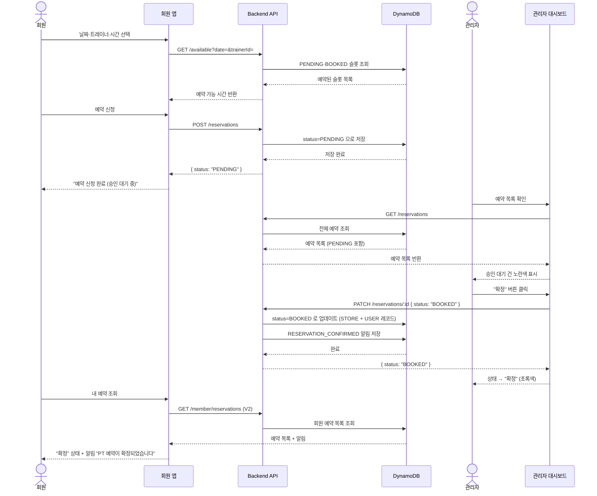
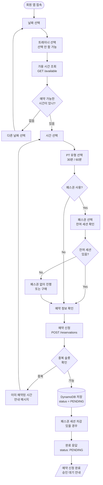
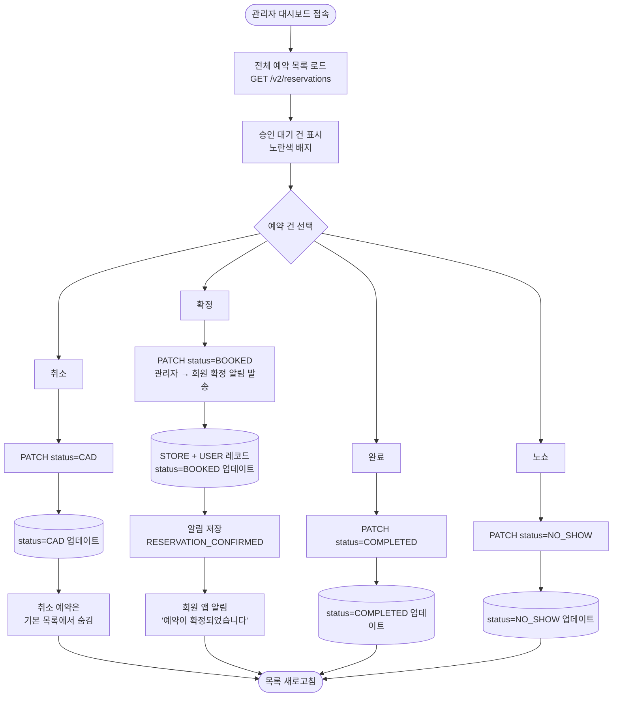
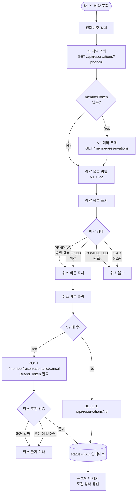
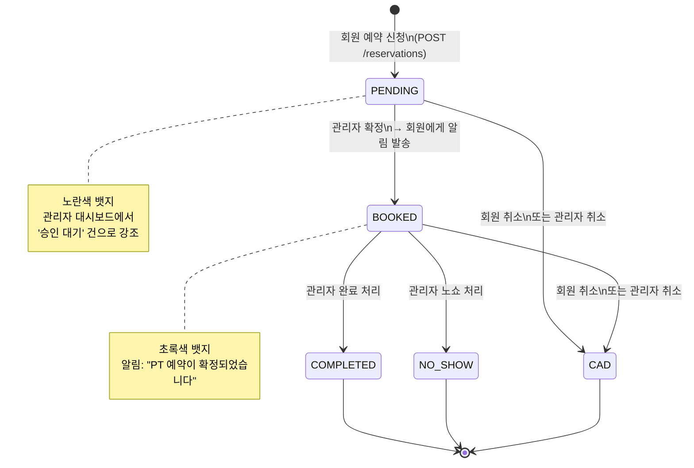

# GymPT 예약 시스템 — 흐름도

| 항목 | 내용 |
|------|------|
| 문서명 | 예약 시스템 흐름도 |
| 버전 | v1.0 |
| 작성일 | 2026-03-25 |
| 기준 | v3.0 (PENDING 승인 흐름 포함) |

---

## 목차

1. [예약 상태 정의](#1-예약-상태-정의)
2. [전체 예약 흐름 (회원 → 관리자)](#2-전체-예약-흐름-회원--관리자)
3. [회원 예약 신청 흐름](#3-회원-예약-신청-흐름)
4. [관리자 예약 처리 흐름](#4-관리자-예약-처리-흐름)
5. [회원 예약 취소 흐름](#5-회원-예약-취소-흐름)
6. [상태 전이도](#6-상태-전이도)
7. [API 엔드포인트 매핑](#7-api-엔드포인트-매핑)

---

## 1. 예약 상태 정의

| 상태 코드 | 화면 표시 | 색상 | 설명 |
|-----------|----------|------|------|
| `PENDING` | 승인 대기 | 노란색 | 회원이 신청 후 관리자 승인 대기 중 |
| `BOOKED` | 확정 | 초록색 | 관리자가 승인 완료, 예약 확정 |
| `COMPLETED` | 완료 | 파란색 | PT 수업 완료 |
| `CAD` | 취소 | 빨간색 | 회원 또는 관리자가 취소 |
| `NO_SHOW` | 노쇼 | 회색 | 회원이 예약 시간에 나타나지 않음 |

---

## 2. 전체 예약 흐름 (회원 → 관리자)



---

## 3. 회원 예약 신청 흐름



---

## 4. 관리자 예약 처리 흐름



---

## 5. 회원 예약 취소 흐름



---

## 6. 상태 전이도



---

## 7. API 엔드포인트 매핑

### 회원 (Member)

| 동작 | Method | Endpoint | 인증 |
|------|--------|----------|------|
| 가용 슬롯 조회 | `GET` | `/api/v2/stores/:storeId/reservations/available?date=&trainerId=` | 없음 |
| 예약 신청 | `POST` | `/api/v2/stores/:storeId/reservations` | 없음 (userId 필요) |
| 내 예약 목록 조회 (V2) | `GET` | `/api/v2/stores/:storeId/member/reservations` | Bearer memberToken |
| 내 예약 목록 조회 (V1) | `GET` | `/api/reservations?phone=` | 없음 |
| 예약 취소 (V2) | `POST` | `/api/v2/stores/:storeId/member/reservations/:id/cancel` | Bearer memberToken |
| 예약 취소 (V1) | `DELETE` | `/api/reservations/:id` | 없음 |

### 관리자 (Admin)

| 동작 | Method | Endpoint | 인증 |
|------|--------|----------|------|
| 전체 예약 목록 | `GET` | `/api/v2/stores/:storeId/reservations` | 없음 (관리자 JWT 권장) |
| 예약 상태 변경 | `PATCH` | `/api/v2/stores/:storeId/reservations/:id` | 없음 (관리자 JWT 권장) |

### 알림 (Notification)

| 동작 | Method | Endpoint | 발생 시점 |
|------|--------|----------|----------|
| 알림 조회 | `GET` | `/api/v2/users/:userId/notifications` | 회원 앱 접속 시 |
| 알림 읽음 처리 | `PATCH` | `/api/v2/users/:userId/notifications/:notifId` | 알림 클릭 시 |
| 알림 발송 (자동) | 내부 | `createNotification()` | 예약 확정 (`PENDING→BOOKED`) 시 |

---

## 보충 — 슬롯 중복 방지 로직

```
예약 신청 시:
  STORE#{storeId} / RESERVATION#{date}#{time}#{trainerId}
  → 해당 SK에 PENDING 또는 BOOKED 상태 레코드가 있으면 → 409 중복 에러

가용 시간 조회 시:
  PENDING + BOOKED 상태인 슬롯 → availableSlots 에서 제외
  CAD / COMPLETED / NO_SHOW 상태 → 해당 슬롯 재예약 가능
```

---

## 보충 — DynamoDB 레코드 구조

예약 1건당 **2개의 레코드** 생성 (원자적 트랜잭션):

```
STORE 레코드 (날짜·트레이너 기준 조회용)
  PK: STORE#store_default
  SK: RESERVATION#2026-03-25#09:00#trainer_001
  status: PENDING → BOOKED
  userId, date, time, reservationId, ...

USER 레코드 (회원 이력 조회용)
  PK: USER#abc-123
  SK: RESERVATION#2026-03-25T09:00:00
  status: PENDING → BOOKED (관리자 변경 시 동기화)
  reservationId, date, time, ...
```
